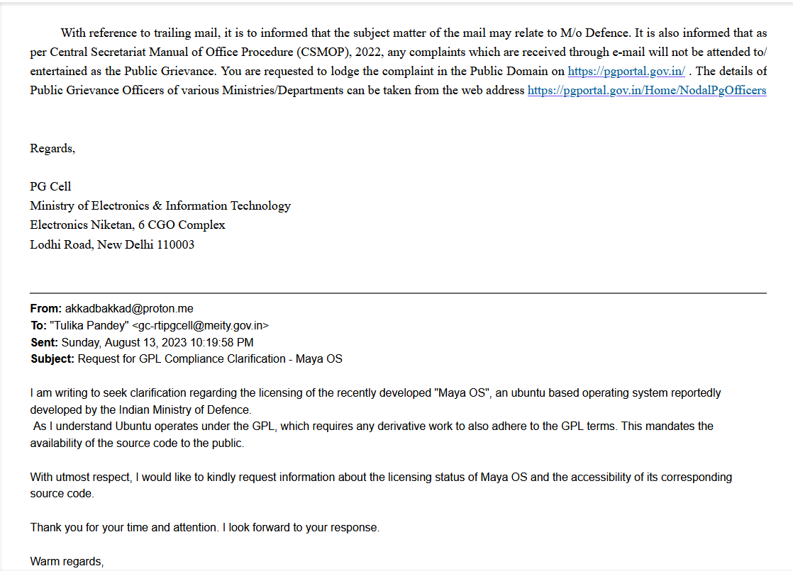
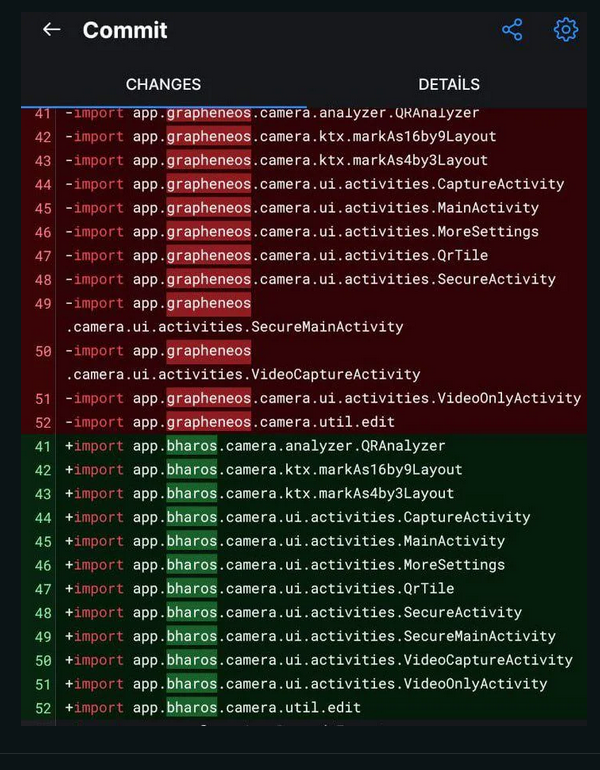

## Introduction

**I noticed something that raises some red flags about two recent "indigenous" operating systems by India, BharOS and MayaOS. There are concerns about whether these OSes are following the rules of open-source software licenses, especially the GNU General Public License (GPL). And I think it's worth digging into this issue.**

## Maya OS
Maya OS is an ubuntu based operating system developed by the Indian Defence Research and Development Organisation. Since MayaOS is ubuntu based, it operates under the GPL, which requires any derivative work to also adhere to the GPL terms. This mandates the availability of the source code to the public. However, the code is not publicly available, which i find concerning because it's against the GPL's rules for using GPL-licensed software.

When i read about this, i tries to contact Ministry of IT, India through email. They responded with basically saying that the matter might fall under the purview of the Ministry of Defence. I wrote to their Public Grievance email too, but unfortunately they didnt respond.

## Bhar OS: More like bhar me jaye OS

Similarly, BharOS, a mobile OS developed by IIT, Madras, is said to be designed for users who need strong privacy and security. However, leaked source code suggests that BharOS is mostly a copy of GrapheneOS with very few changes but ironically IIT Madras director claimed that it took them 1 year to develop the OS. This raises questions about whether BharOS is truly original and whether the claims of being "indigenous" are misleading.

## Conclusion
These cases highlight possible license violations. GPL ensures that software based on GPL is also released under the same license, promoting openness and collaboration with the open-source community.
