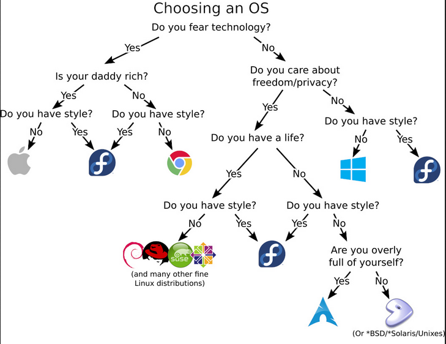
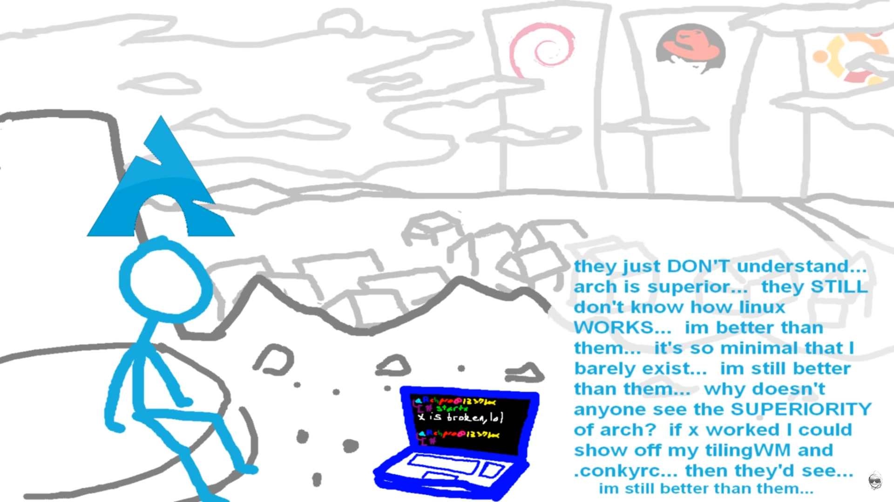

## Introduction

There's a book called *The Paradox of Choice* by Barry Schwartz. The idea is — more options can actually make people more stressed and indecisive. Sounds weird, but it’s real. And it shows up in the Linux world more than you’d think.

The number of Linux distros out there is insane. If you’re new, it’s easy to get lost. You either pick something random and hope for the best, or fall into a rabbit hole of forums and opinions trying to find “the best one.”

## Distro hopping

Most people start with Ubuntu — it’s beginner-friendly, works out of the box. But then you read somewhere that “Ubuntu is for noobs” and “real users install Arch.” So you start to question your choice.

That’s where distro hopping kicks in. You try one distro, then another, then another. Always looking for the perfect one. Truth is — it doesn’t exist. Every distro has pros and cons. No matter what you pick, there’s always going to be trade-offs.

## How to avoid the paradox of choice

The best way to avoid this mess? Focus on *why* you're using Linux in the first place.

If you’re here to actually get stuff done — it probably doesn’t matter if you’re using apt, pacman, or zypper. Most major distros are stable, customizable, and can run whatever you need.

Let’s say you don’t like the desktop environment on your current distro. You don’t need to reinstall a whole new OS just for that. Just install another DE — KDE, XFCE, MATE, whatever suits you. No need to learn a new package manager or deal with a new ecosystem unless you really have to.

## The “performance” trap

Another common reason people switch is performance. Like, “I’ll install Arch because it’s minimal and boots faster.”

Sure, maybe you save a couple of seconds on startup. But is that worth the time you’ll spend setting things up, fixing broken packages, or learning system internals just to maintain it? For most people, probably not.

Unless you *enjoy* that kind of thing, or really need full control, the performance gains are usually too small to matter.

## Final thought

Linux gives you a lot of freedom. That’s the best and worst thing about it.

Just don’t let choice get in the way of progress. Find a distro that works for you, stick with it for a while, and focus on actually using your system — not constantly rebuilding it.

