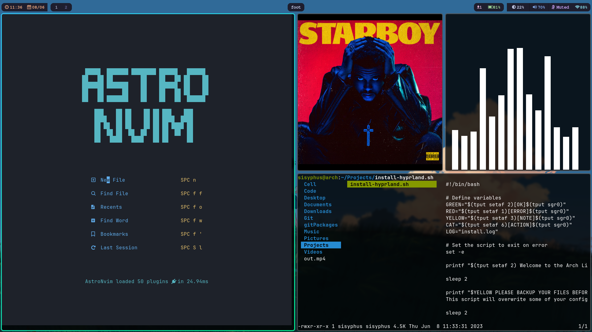

**This is a list of all (almost) the software i use on my pc as well as on my phone.**


## My Setup





## PC

- ``` Operating System ```:
I use [Arch Linux](https://archlinux.org/) beacuse of its simplicity and KISS ( keep it simple, stupid!) philosophy. Arch linux has a rolling release model. It also has a large and active community, which means there is a lot of support available if you need it.

- ```Terminal```:
[Foot](https://codeberg.org/dnkl/foot): I use this tiny program called foot as my terminal emulator. Its pretty cool. (I like feet.)

- ```Shell```:
I use [zsh](https://www.zsh.org/) as my default shell. It supports a lot of plugins and has auto tab completion and syntax highlighting too. You can try my zsh configurations here

- ```Text Editor```:
[Neovim](https://neovim.io/), which is terminal based vim like text editor with a little more features and plugins. Like vim, it doesn’t require mouse and is completely keyboard centric.

- ```Window Manager/compositor```:
I am using [Hyprland](https://hyprland.org/) which is a dynamic tiling Wayland compositor based on wlroots. It is easy to customize and rice. I have already written a blog on [how to rice hyprland like mine](https://saqibmir.me/blog/switching-to-hyprland/).

- ```Media Player```:
For media (music/videos) consumption, i use [mpv](https://mpv.io/) which is a Lightweight, opensource and is highly customoizable and can be extended with scripts and plugins.

- ```Web Browser```:
I keep switching browsers every once in a while because they all suck. The one that I am using as of now is called [librewolf](https://librewolf.net/). It is lghtweight, opensource and is highly customizable and can be extended with scripts and plugins. I use [uBlock Origin]() to block ads and trackers. 

- ```File Manager```:
I use a terminal based file manager called [lf](https://github.com/gokcehan/lf) which is just like ranger but its written in go so its a lot faster.It also has a lot of great features like tabs, previewing of files and integration with other cli tools. I also use [thunar]() sometimes.

- ```Synchronization```:
[Syncthing](https://syncthing.net/); Useful for synching files over the same network.

- ```Office Suite```:
[Libre Office](https://www.libreoffice.org/): I mean do i even have any other choice here?

- ```Consoom```:
[Jellyfin](https://jellyfin.org/) is a media server and suite of multimedia applications designed to organize, manage, and share digital media files to networked devices. I consoom movies and shows using jellyfin sometimes.

- ```Status Bar```:
I am using [waybar-hyprland](https://wiki.hyprland.org/Useful-Utilities/Status-Bars/) which is a fork of waybar. It's pretty simple to use and configure.


- ```Pdf Reader```:
[zathura](https://github.com/pwmt/zathura) has vim keybindings. What else can one ask for?

- ```Password Manager```:
[KeePassXC](https://keepassxc.org/) is an offline password manager. I wrote a blog about [how i sync my passwords across multiple devices](https://saqibmir.me/blog/passwords/)

## Phone

- ```Operation System```:
I use a custom rom called [Lineage OS](https://lineageos.org/) with gapps. 

- ```File Manager```:
[Simple File Manager Pro](); goofy ahh name, but it's opensource and gets the job done.

- ```Web Browser```:
I use [Bromite](https://www.bromite.org/) which is a chromium fork with ad blocking and enhanced provacy.

- ```App Store```:
I have play store since you cant remove it if you use google services, but i use [fdroid](https://f-droid.org/en/) whenever possible.

- ```Email```:
I use [K9 Mail](https://k9mail.app/) on my phone for emails.

- ```Cloud Storeage```:
[MEGA](https://mega.io/), It's licence is unclear but i think client source is open-source.

- ```Epub Reader```:
I like to read books on my phone and for that i use Google Play Books (Proprietary again). I use it with wifi and mobile data permissions disabled.

- ```Pdf Reader```:
For PDFs, i use [MuPDF](https://mupdf.com/). It's Lightweight, has encryption, hyperlinks, annonations, seearhing, form editing features.

- ```Youtube Client```:
[Revanced](https://revanced.net/) and [Newpipe](https://newpipe.net/) are FOSS opensource front ends of Youtube with premium features. Revanced uses microg, which is a free re-implementation of Google’s proprietary android user space apps and libraries.


- ```Consoom```:
I use [Jellyfin](https://jellyfin.org/) on my phone too.

- ```Others```:
All the other apps (Calculator, Gallery, Dialer, Contacts, Recorder etc) are the default ones that come pre-installed with Lineage OS. All are open-source ofc.


I use some proprietary software on my phone that i can't live without. These are separeted out beacuse i do not recommend such:

```
telegram
whatsapp
gpay
google play books
google maps
```


**Note**: You can check the list of all the software i use with hyprland [in this script](https://github.com/saqibmir1/hyprland-dotfiles/blob/main/install-hyprland.sh).
