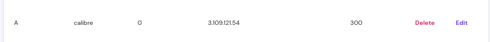

+++
title = 'I Bought a New Domain'
date = 2025-05-20T14:23:07+05:30
draft = false
+++
## Introduction
So, I ended up buying a new domain—mostly because it was super cheap. Figured I might as well use it for a year.

I also signed up for AWS Free Tier, which gives me 750 hours of EC2 usage per month for a whole year. Now that I’ve got both a domain and a VPS, I guess it’s time to become death, destroyer of idle servers.

I’ve set up a public Calibre server at [calibre.saqibmir.site](https://calibre.saqibmir.site)  and I also built a webpage with the help of AI that shows real-time updates and stats from Last.fm and Spotify—check it out [here](https://saqibmir.site/about/lastfm-stats.html). It's pretty cool imo.  It uses the Last.fm API under the hood.

I wanted to write this blog to show how easy it is to set up your own Calibre server. It doesn’t take much—just a domain, a VPS, and a bit of time. Hopefully, this will help someone else realize how simple (and fun) self-hosting can be using pre-existing "self-hostable" services.

### Set up your own calibre service

#### Prerequisites
- An A record with name ```calibre``` pointing to your server like this:



#### Procedure
- Install calibre

```shell
apt install -y calibre
```

- Prepare directories
```shell
mkdir -p /opt/calibre/my_library
```
- Upload a book (manually for the sake of simplicity)
```shell
cd /opt/calibre
calibredb add /path/to/book.epub --with-library my_library
```
- Create a service
Create a new file ```/etc/systemd/system/calibre-server.service``` 
```shell
[Unit]
Description=Calibre library server
After=network.target

[Service]
Type=simple
User=root
Group=root
ExecStart=/usr/bin/calibre-server --enable-local-write /opt/calibre/your_library --listen-on 127.0.0.1

[Install]
WantedBy=multi-user.target
```

- Enable and start the service
```shell
systemctl enable --now calibre-server
```

- Create a reverse proxy with nginx
First create a file ```/etc/nginx/sites-available/calibre```
```shell
server {
    listen 80;
    client_max_body_size 64M; # to upload large books
    server_name calibre.<yourdomain> ;

    location / {
        proxy_pass http://127.0.0.1:8080;
    }
```
Then enable the site
```shell
ls -s /etc/nginx/sites-available/nginx /etc/nginx/sites-enabled/
```

- Issue a let's encrypt certificate
```shell
certbot --nginx
```

Reload nginx
```shell
nginx -s reload
```
Done! Now just go to calibre.<yourdomain>