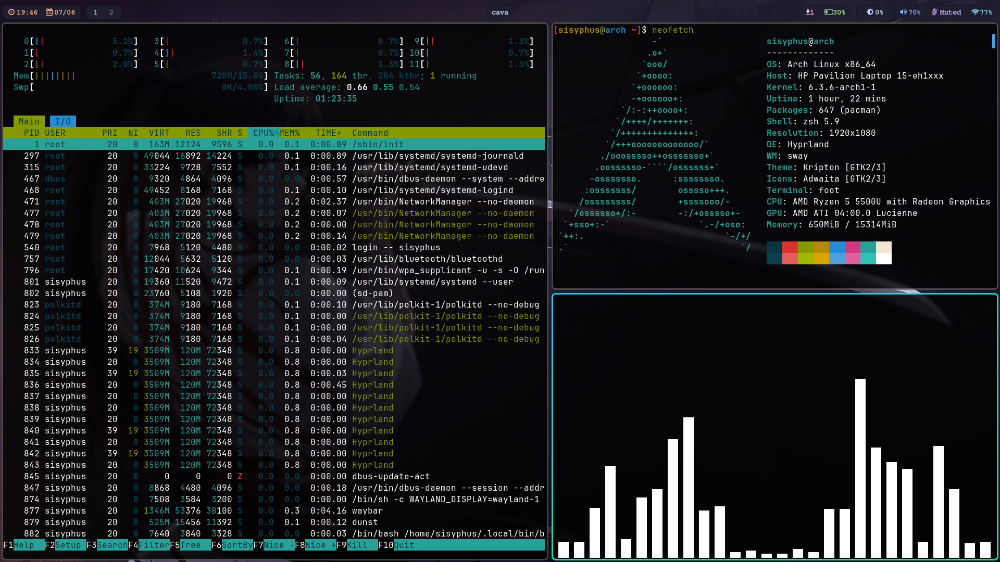

**[Hyprland](https://hyprland.org) is a dynamic tiling [Wayland](https://wayland.freedesktop.org) (a replacement for the X11 window system protocol and architectur) compositor based on [wlroots](https://way-cooler.org/book/wlroots_introduction.html).**

## Introduction
I have used tiling window manager ever since i came to know about them (very recently really). I was using dwm which is based on xorg but since everybody was moving to hyprland
i decided i should move to wayland too since it is modern and more efficient than xorg.

## What is hyprland (again)

Hyprland is a dynamic tiling Wayland compositor based on wlroots. Although is an under development project, but it has already gained a lot of popularity and even though things break, it's not a big deal. I can fix them with a little research (i have no life).

Hyprland supports a variety of layouts, including tiling, floating, and tabbed windows. It also has a number of features that are not found in other Wayland compositors, such as window animations, rounded corners, and Dual-Kawase Blur on transparent windows.

## Why hyprland
DWM had everything i ever needed but hyprland is just better. In DWM, i had to do a lot of stuff on my own. Patches, configuring touchpad, window swallowing etc. Not to mention
DWM doesn't have a config file. I had to modify the source code and recompile the software. Hyprland  has build in functionalities for so many things and the configuration file is so easy to understand.

## How to install
Installation guide is on their wiki so i'll be brief:
- Install these packages:

```shell
hyprland dunst pipewire wireplumber xdg-desktop-portal-hyprland polkit-kde-agent qt5-wayland qt6-wayland kitty
```

Note that the above package names are for arch linux and might be different for your distribution.

- Start hyprland from tty by typing ```Hyprland```

You can add this line to your ```.shellprofile``` file for autostart:

```exec Hyprland```

- Your hyprland desktop should launch. Hyprland stores its config at ```$HOME/.config/hypr/hyprland.conf```. Modify it to your liking

>Protip: Launch kitty using ```MOD+Q```

## My rice?



## How to rice like mine?
I gotchu. I have uploaded my dotfiles on github [here](https://github.com/saqibmir1/hyprland-dotfiles.git). I also have written a shell script (inspired from: [christitus.com](https://christitus.com)) which will install
the required packags and deploy my dotfiles.

### How to (for noobies)
- Install arch linux. Add a user with sudo perms. Login as a user.

- Run these commands one by one:

 ```shell
sudo pacman -S git
git clone --depth 1 https://github.com/saqibmir1/hyprland-dotfiles.git
cd hyprland-dotfiles
bash install-hyprland.sh
```

### Some important point about the script
- Make sure you read the script before executing.
- The dependencies are listed in the script itself. 
- The script will save log in install.log. If something goes wrong. You can always read the log file.
- The script requires root access in order to install packages. 

### Important packages used:
- Theme: Kripton
- Terminal: Foot
- Browser: Firefox
- Application Launcher: Rofi
- Status Bar: Waybar

### Some basic keybindings:
| function          | keybinding    |
|-------------------|---------------|
| launch terminal   | Mod+Enter     |
| toggle fullscreen | Mod+W         |
| toggle master     | Mod+SPACE     |
| close window      | Mod+Q         |
| launch thunar     | Mod+E         |
| launch firefox    | Mod+B         |
| launch clipboard  | Mod+V         |
| launch rofi       | Mod+P         |
| powermenu         | Mod+BACKSPACE |
| lock screen       | Mod+L         |


